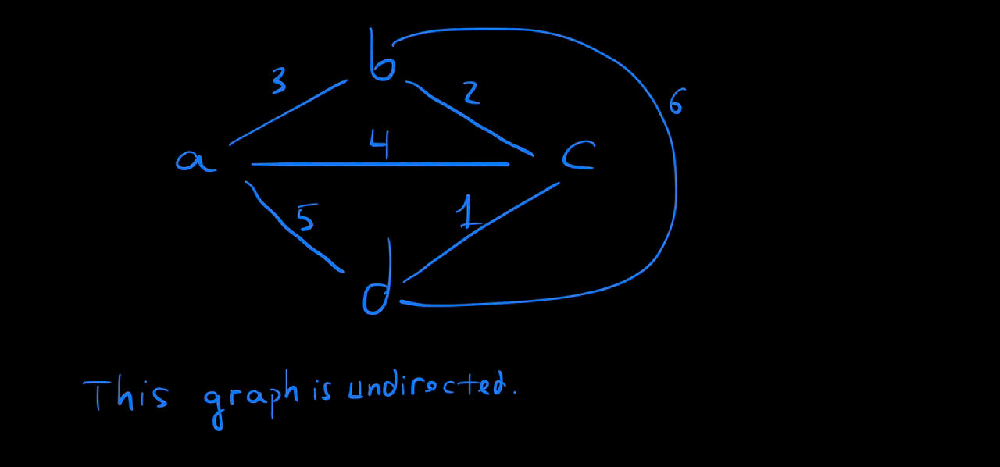

# Project Title:
Traveling Salesperson

# Description:
This project:
+ is implemented in Python.
+ implements the TSP algorithm (is a algorithm used to find a path to visit every vertex ONCE with the minimum cost (minimum total of edge weights)).
Features
+ using data structure like Graph.

# Features:
+ This project has a built-in graph. For the sake of simplicity, here's a visualization of our graph:

+ Return the shortest path with the minimum cost.

# How to use:
Open the terminal, run python3 script.py (Note that each execution will lead to different outputs because the starting vertex is randomly chosen.)

# Collaborators: 
This project is developved by myself based on the instructions given on Codecademy.

# License: 
MIT license.